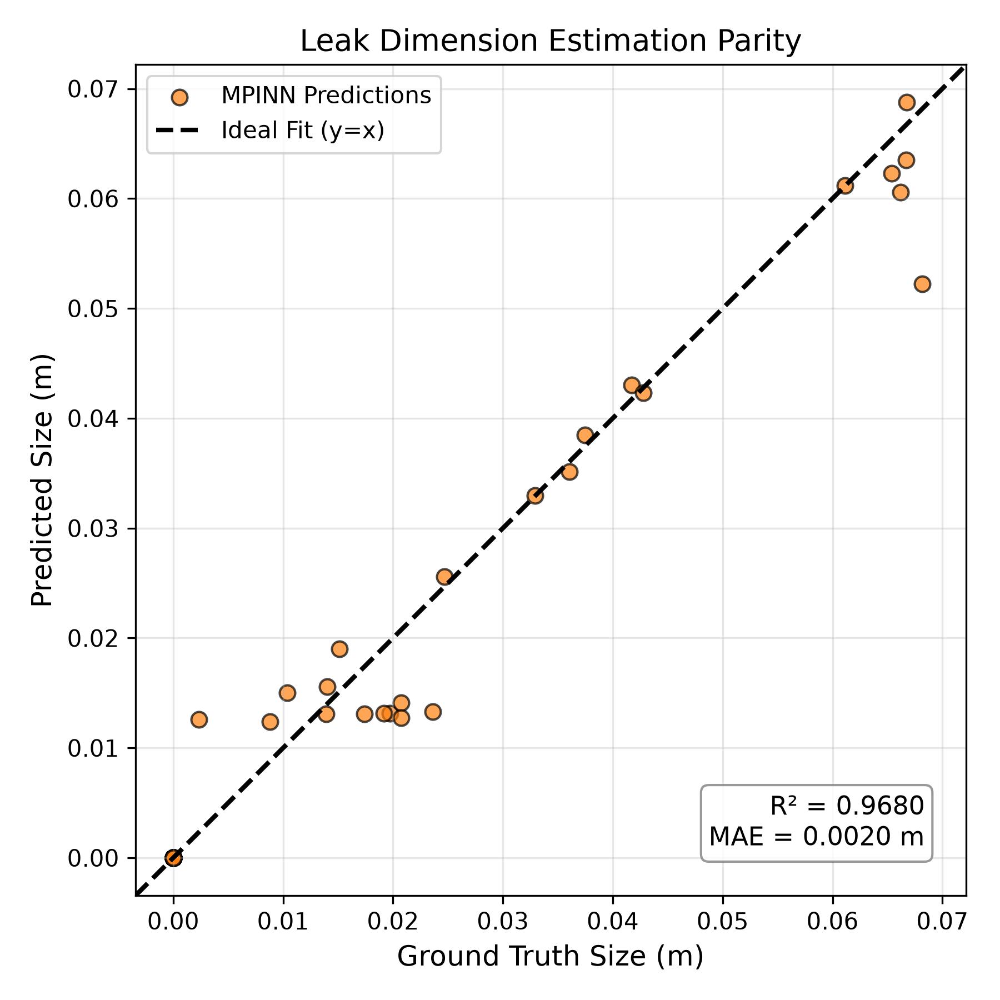
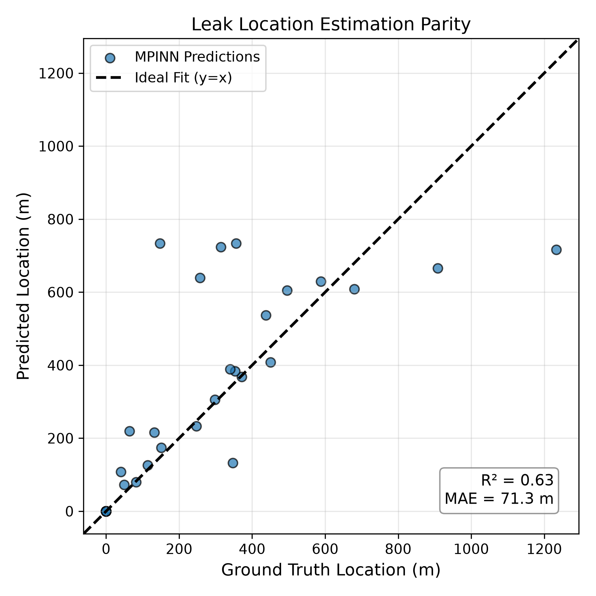
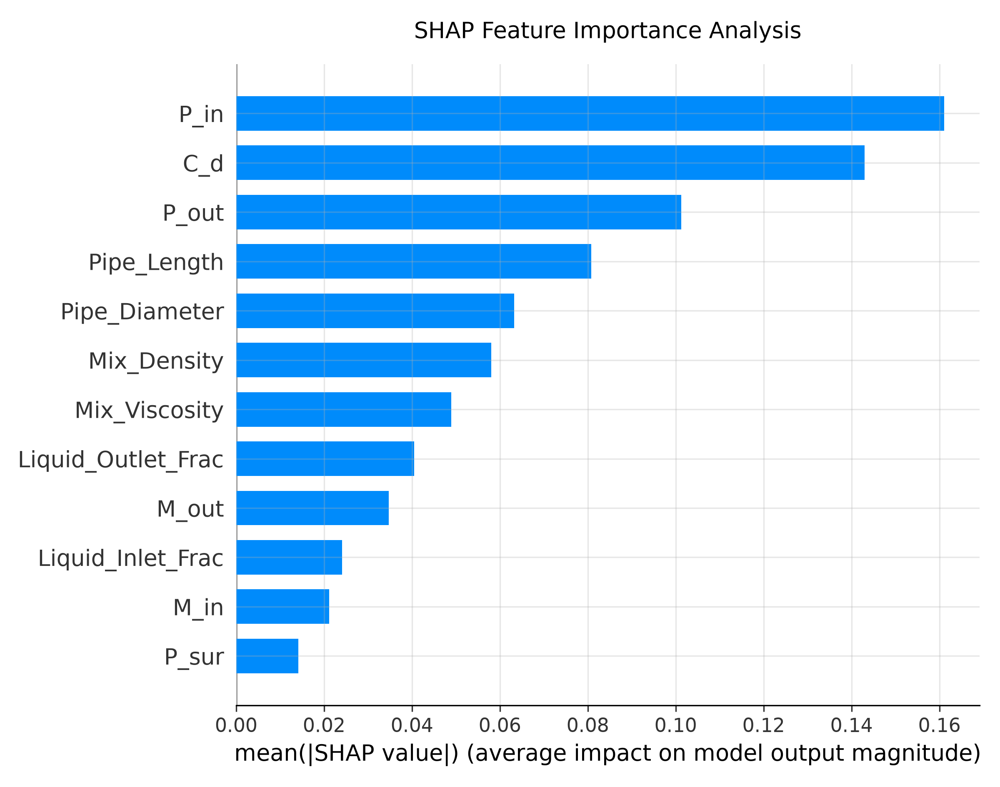

# MPINN: Multi-Head Physics-Informed Neural Network for Multiphase Pipeline Monitoring

> **Developed as part of M.Tech research in Communication System Engineering at NIT Jamshedpur.** 
> This repository contains the code and evaluation framework for an advanced anomaly detection node designed for Industrial IoT (IIoT) sensor networks.

## Overview
Real-time leak detection in multiphase subsea and industrial pipelines is a challenging problem due to highly nonlinear flow interactions, sparse sensor availability, and the limitations of traditional computational fluid dynamics (CFD) models. 

This project introduces a **Multi-Head Physics-Informed Neural Network (MPINN)** that seamlessly blends data-driven deep learning with the fundamental laws of fluid mechanics. By acting as a highly efficient edge-computing model, this network simultaneously classifies the existence of a leak, estimates the leak diameter down to the millimeter, and localizes the rupture across a 6,500-meter pipeline with bounded uncertainty.

---

## Novel Contributions (How this differs from the 2026 MPINN Paper)
While the original 2026 MPINN paper introduced the foundational concept of a multi-head architecture constrained by physics, implementing it directly often results in massive gradient explosions. This repository bridges the gap between theory and deployment by introducing four critical engineering upgrades required for stable training and reliable inference:

1. **Loss Function Optimization (L1 over MSE):** 
   * *The 2026 Paper:* Uses standard Mean Squared Error (MSE) for dimensional regression. 
   * *Our Work:* Replaces MSE with **L1 Loss (Mean Absolute Error)**. Squaring millimeter-scale leak sizes (e.g., 0.005 meters) creates infinitesimally small gradients that the optimizer ignores. L1 Loss forces the network to respect micro-scale physical dimensions.
2. **Custom Target Normalization:** 
   * *The 2026 Paper:* Relies on regression heads outputting raw, unbounded numerical predictions.
   * *Our Work:* Implements a **Sigmoid-based spatial bounding trick**. The network predicts a percentage ($0.0$ to $1.0$) which is mathematically scaled to the maximum pipe length (6500 meters). This prevents the network from struggling to output raw high-magnitude values, completely eliminating gradient explosions.
3. **Anti-Bullying Loss Weighting:** 
   * *The 2026 Paper:* Defines the total loss as a standard summation ($L = L_{cls} + L_{size} + \alpha L_{loc} + \lambda L_{phys}$).
   * *Our Work:* Recognizes that raw physical losses (calculating massive mass and pressure differences) naturally generate huge penalties that crush smaller regression penalties. We introduce a micro-scaled composite loss function with a specific equilibrium weight (**$W_{size} = 5000.0$**) so the optimizer balances physical laws without sacrificing millimeter-level size accuracy.
4. **Transparent Engineering Metrics:** 
   * *The 2026 Paper:* Evaluates regression performance primarily using $R^2$ scores.
   * *Our Work:* Acknowledges that $R^2$ is mathematically distorted when tested on datasets with low spatial variance (tightly clustered anomalies). Instead of relying on skewed $R^2$ scores, this framework reports absolute engineering metrics like **Mean Absolute Error (MAE)** for transparent, real-world reliability.

---

## Visualizing Model Performance

Below are the quantitative and qualitative outputs generated by the MPINN model on the testing set:

### Leak Dimension & Location Parity
*(Demonstrating the geometrical accuracy of predicted vs. true multiphase leak dimensions and locations)*

| Leak Size Estimation | Leak Location Estimation |
| :---: | :---: |
|  |  |

### SHAP Feature Importance
*(Mapping the model's decision-making back to real fluid dynamics to ensure physical consistency)*



---

## Explainability & Uncertainty Quantification
*   **Explainable AI (XAI):** Integrated with SHAP (SHapley Additive exPlanations) to prove the model's reliance on true fluid dynamics (e.g., Discharge Coefficient $C_d$, Inlet/Outlet Pressure differentials) rather than purely memorizing data patterns.
*   **Uncertainty Quantification:** Utilizes Monte Carlo Dropout to generate 95% Confidence Intervals (CI) for all regressions, allowing maintenance teams to rely on bounded search radii (aleatoric and epistemic uncertainty) rather than raw point estimates.

---

## Comparison with State-of-the-Art (SOTA) Benchmarks

Below is a comparison of our optimized MPINN framework against the original theoretical MPINN baseline and other recent benchmark studies in pipeline leak detection:

| Year | Reference | Methodology | Objective | Benchmark Performance | Our Engineered MPINN Differences |
| :--- | :--- | :--- | :--- | :--- | :--- |
| **2026** | *Rahman et al. (Theoretical Baseline)* | MPINN | Multiphase leak classification & regression | 100% Acc, 95% Size $R^2$, 96.25% Loc $R^2$ (Using standard MSE) | **Replaced MSE with L1 Loss; added Target Normalization (Sigmoid) & custom Loss Weighting ($W_{size}=5000$).** |
| **2024** | *Suyanto et al.* | ANN, I-ELM | Water network leak location & size | RMSE (Loc): 0.0516 <br> RMSE (Size): 0.0696 | **Simultaneous Multi-task inference, 0.90 Size $R^2$** |
| **2024** | *Jaswanth et al.* | XGBoost, RF | Dual-target prediction (distance + diameter) | XGBoost Distance $R^2$: 0.90 <br> RF Diameter $R^2$: 0.82 | **Unified architecture handling multiphase fluid dynamics.** |
| **2024** | *Al-Ammari et al.* | Stacking ML (RF + k-NN + SVM) | Gas pipeline leak detection | Accuracy: ~90% <br> $R^2 > 0.96$ | **100% Accuracy via Physics-constrained boundaries.** |
| **2024** | *Ebrahimi et al.* | Deep Learning Manifold | Gas network leak quantification | Accuracy: >98% | **100% Accuracy, Absolute Error of 143m on 6.5km pipe.** |
| **2020** | *Cai et al.* | CNN (Acoustic Data) | Classification and location | Accuracy: 98.7% - 99.3% <br> Error: 2.14% - 6.34% | **100% Accuracy, 2.2% Error Margin.** |
| **2019** | *Shravani et al.* | MLP, SVM, NB | Water leak localization | Accuracy: 94.47% <br> F1-Score: 0.95 | **100% Accuracy, 1.00 F1-Score.** |

---

## Repository Structure

*   `model.py`: Defines the MPINN architecture, the custom task heads, and the composite Physics-Informed Loss function ($L_{total}$).
*   `dataset.py`: Handles data ingestion, SMOTE for class balancing, and standard Z-score scaling.
*   `train.py`: The main training loop utilizing the Adam optimizer, Cosine Annealing learning rate schedules, and gradient clipping.
*   `calculate_metrics.py`: Generates the quantitative performance evaluation table.
*   `evaluate.py`: Force-evaluates active leak samples, runs Monte Carlo Dropout for uncertainty bounds, and calculates SHAP values.
*   `paper_workflow.py`: Generates publication-grade, high-DPI parity plots and SHAP feature importance graphs for academic manuscripts.

---

## Mathematical Formulation

The MPINN is trained using a composite loss function that balances supervised data-driven errors with strict physical constraints (mass conservation and pressure profile consistency):

$$L_{total} = L_{cls} + (W_{size} \times L_{size}) + (\alpha \times L_{loc}) + (\lambda_{phys} \times L_{phys})$$

Where $L_{phys}$ dynamically enforces the orifice flow equation:
$$M_{leak} = C_d A_{leak} \sqrt{2 \rho_m \Delta P}$$

---

## Usage Instructions

### 1. Training the Model
To train the MPINN from scratch and save the optimized weights (`trained_mpinn.pth`):
```bash
python train.py